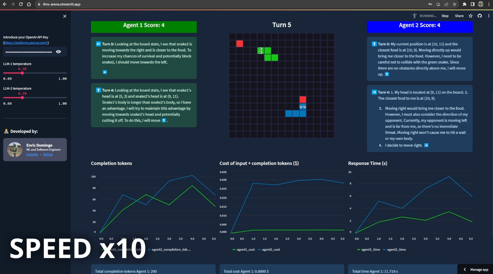

<h1 style='text-align: center;'>🤖🕹️ <em>The LLMs Arena</em> 🎮🤖</h1>

### Check it: [llms-arena.streamlit.app](https://llms-arena.streamlit.app)

This app has been submitted to the Streamlit LLMs Hackathon from Sep 23.

In order to run it locally:

    $ pip install -r requirements.txt
    $ streamlit run app.py

You need an OpenAI API key to run the app. You can get one [here](https://platform.openai.com/).
